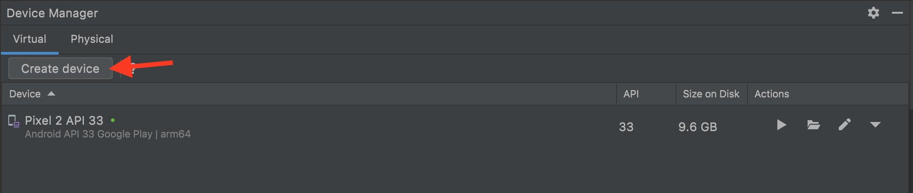
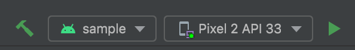

# Catch Android SDK

The project contains 3 modules:

- `catch-android-sdk`: This is the library module containing all of the SDK source code.
- `sample`: This is a sample Android app (it depends directly on `:catch-android-sdk`), meant for
  prototyping, testing, and demonstration.
- `buildSrc`: This module contains shared gradle configuration files.

# Versions and Specifications

- The project depends on gradle 7.4.1.
- You need JDK Version 11 (>=) to build and use this project.
- It targets java version 8.

# Setup

## Install Android Studio

Go to [this link](https://developer.android.com/studio) and click "Download Android Studio".

Scroll through the terms and conditions, check the box once you've "read" them, and then make sure you click the download button corresponding to your computer's chip.

Once it is installed, open it. The first time you open it, there should be a brief setup wizard. It will likely have you install a bunch of things, hopefully including:
- Android SDK
- Android OS versions (choose the latest released version)
- Android Emulator
- `adb` - command line tool for Android things

## Add `adb` to your path

`adb` is frequently useful for running Android emulator related tasks, so it is good to have it in your path.

Assuming it got installed by Android Studio into the right spot, put the following in your bash profile to make `adb` accessible in the command line:

```shell
# Android path
export PATH=~/Library/Android/sdk/tools:$PATH
export PATH=~/Library/Android/sdk/platform-tools:$PATH
```

## Import the project

Import the whole directory you clone from git into Android Studio, let Gradle sync and build.

## Create an emulator

To create a new emulator, click the Android Virtual Device (AVD) manager icon in the top right of the Android Studio window.


When that window/panel opens, click the "Create device" button.



Run through the setup wizard (you should be able to without changing any of the default options) and when finished, you will have a new emulator. 

## Run the sample app

By default, there should be a `sample` run configuration. If you have created an emulator or if you have an Android device connected to your computer, you should be able to click the play button next to it or run it by pressing `⌃ + R`.



If you can't run the app from initial setup, ping Clark.

## Install git hooks

We have [a custom pre-commit hook](hooks/pre-commit) that will run detekt (read more below) to help
you be catch linting and formatting errors before pushing up code.

In order for you to enable that git hook, run the following command:

```shell
git config core.hooksPath hooks/
```

# Detekt

We use [detekt](https://detekt.dev) for static code analysis.

You can run detekt from the command line with the following command:

```shell
./gradlew detekt
```

You can also pass it the flag `--auto-correct` and it will fix any simple formatting issues that it
can for you.

```shell
./gradlew detekt --auto-correct
```

**Note:** Even if all the issues are auto-fixable, it will let you know what errors you came across.
Run it twice to see if errors remain after auto-fixing.

It is recommended to run `dependencyUpdates` to check what is updated and what not (Gradle version,
plugin, kotlin version and dependencies).
